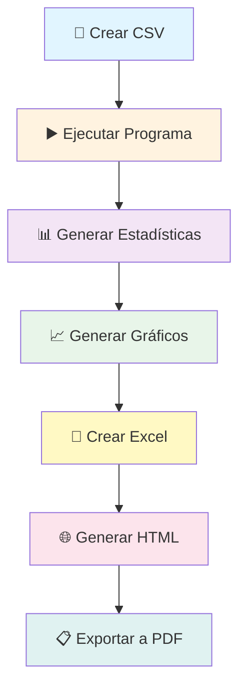
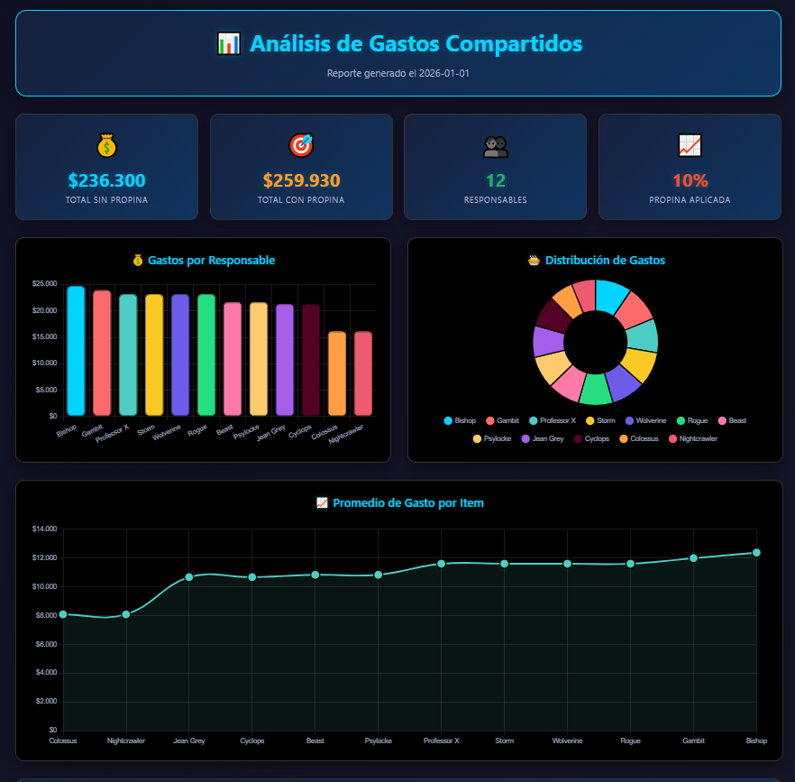
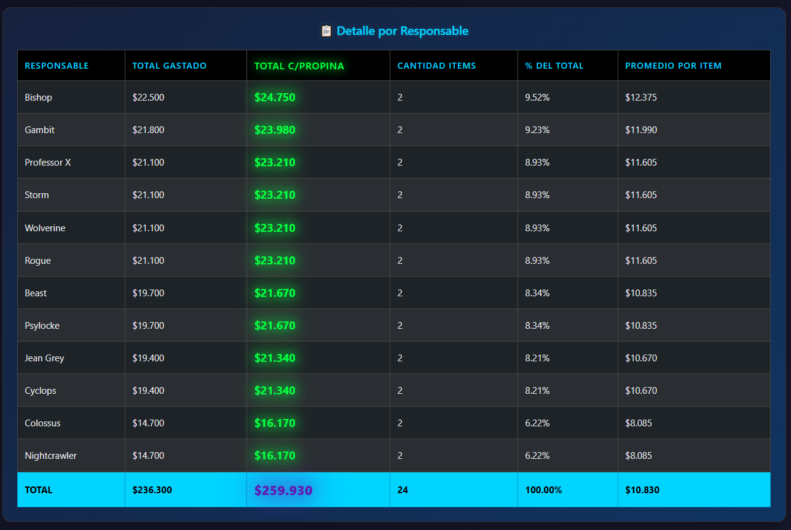
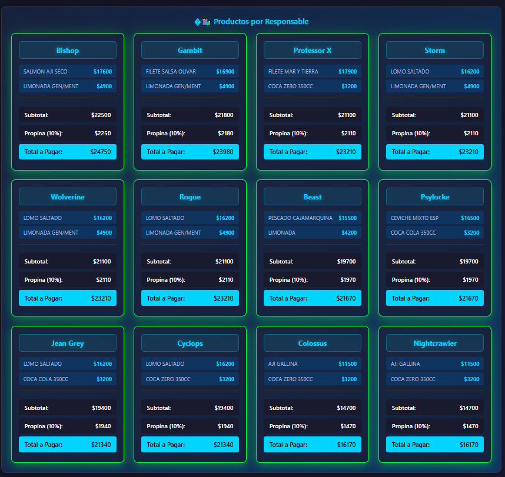

# 🧾 Dividir-Cuentas

Script en Python para dividir la cuenta en un restaurante de manera elegante y eficiente.

## 📊 Sistema de Análisis de Gastos Compartidos

Script que divide la cuenta de forma que cada comensal pague únicamente lo que consumió junto con su correspondiente propina. Como sabemos, en una cuenta la mejor estrategia es pagar solo los gastos de uno y no dividir la cuenta equitativamente, como podemos ver en el artículo [THE INEFFICIENCY OF SPLITTING THE BILL](https://rady.ucsd.edu/_files/faculty-research/uri-gneezy/splitting-bill.pdf).

Este script recibe como entrada un archivo `.csv` que debe tener la estructura específica para cada entrada:

| Cant | Producto | Total | Responsables |
|:----------|:------:|--------:|--------:|
| Cantidad del producto | Nombre del producto  | Monto del producto     | Nombres de los responsables (separados por `;`)|

A esto se le tienen que agregar 4 filas extra con la información del total (la primera boleta con la que trabajé traía estas 4 filas, así que decidí conservarlas):

| Cant | Producto | Total | Responsables |
|:----:|:---------|------:|:-------------|
| Total | General Mesa | Total de la cuenta | |
| Consumo | Cliente | Total de la cuenta | |
| Propina | Sugerida | Propina | |
| Total | c/propina | Total + Propina | |


Por ejemplo:

| Cant | Producto | Total | Responsables |
|:----:|:---------|------:|:-------------|
| 1 | Jugo Limonada | 3150 | Beak |
| 1 | Jugo Piña | 3150 | Jubilee |
| 1 | Limonada Menta-Jenjibre | 3400 | Rockslide |
| 1 | Jugo Frambuesa | 3150 | Pixie |
| 1 | Mix Empanada | 7800 | Beak;Pixie;Jubilee |
| 2 | Filete Italiano | 25900 | Rockslide;Jubilee |
| 1 | Lengua Completa | 10150 | Beak |
| 1 | Hamb Italiana | 8950 | Pixie |
| 1 | Manjar de Los Dioses | 4650 | Beak |
| Total | General Mesa | 70300 | |
| Consumo | Cliente | 70300 | |
| Propina | Sugerida | 7030 | |
| Total | c/propina | 77330 | |


### 💡 Lógica y Flujo de Trabajo

El flujo que realiza el script es el siguiente:



> **Nota**: La boleta se configura en el `main` de `boleta.py`


## 📋 Requisitos

- Python 3.13 o superior
- Dependencias listadas en `requirements.txt`

## 🚀 Instalación

1. **Clonar el repositorio**
```bash
git clone <url-del-repositorio>
cd Dividir-Cuentas
```

2. **Instalar dependencias básicas**
```bash
pip install -r requirements.txt
```

3. **[En caso de error con el PDF] Instalar navegador para que Playwright genere los PDFs**
```bash
playwright install chromium
```

## 📁 Estructura del Proyecto

```
boleta/
│
├── data/                      # Archivos CSV de entrada
│   ├── Boleta01.csv
│   ├── Boleta02.csv
│   └── ...
│
├── reportes/                  # Reportes HTML/PDF generados
│   ├── dashboard_*.html
│   └── dashboard_*.pdf
│
├── boleta.py                  # Script principal de procesamiento
├── reporte.py                 # Generación de reportes HTML/PDF
├── requirements.txt           # Archivo con las dependencias
└── README.md                  # Este archivo
```

## 🎯 Características del Dashboard

El dashboard generado incluye:

- **Tarjetas de Resumen**: Total sin propina, total con propina, número de responsables
- **Gráfico de Barras (Gastos por Responsable)**: Gráfico donde se muestra cuánto gastó cada comensal en forma de barras verticales
- **Gráfico Circular (Distribución de Gastos)**: Igual que el anterior pero ahora en un gráfico de torta
- **Gráfico de Líneas (Promedio de Gasto por Ítem)**: Gráfico donde podemos ver el promedio de gasto por cada comensal en forma ascendente
- **Tabla Detallada (Detalle por Responsable)**: Tabla con el detalle general de cada comensal, donde se destaca el monto final a pagar en la columna Total c/Propina
- **Grid de Productos (Productos por Responsable)**: Gráfico con el detalle específico de cada comensal

## 🎨 Capturas

### Panel de Control



### Análisis Detallado



### Vista de Productos




## Configuración de la Propina
La propina se debe establecer en la variable `PROPINA_PORCENTAJE` del código boleta.py, la cual está configurada al 10%. Para cambiarla, solo se debe modificar la variable.

## 🤝 Contribuir

Las contribuciones son bienvenidas:

1. Haz fork del proyecto (opcional)
2. Crea una rama para tu feature (`git checkout -b Nombre-Rama`)
3. Commit tus cambios (`git commit -m '[Resumen Clave] Detalle: Agregar nueva característica'`)
4. Push a la rama (`git push origin Nombre-Rama`)
5. Abre un Pull Request

## 📝 Licencia

Este proyecto es de código abierto y está disponible bajo la licencia MIT.

## 📧 Contacto

Para preguntas o sugerencias, por favor abre un issue en el repositorio.

---

**Desarrollado porque me llego un ataque de autismo y me dieron ganas de programar**
